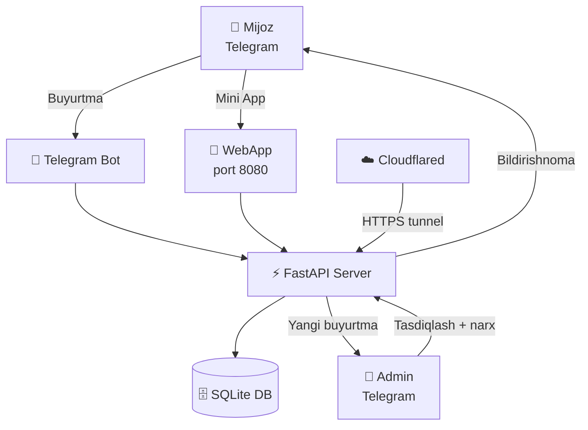
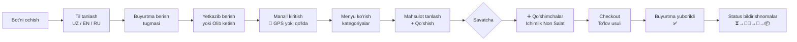
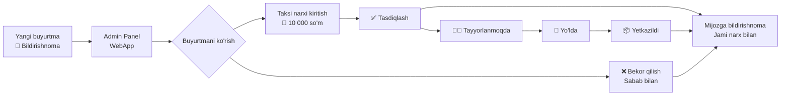
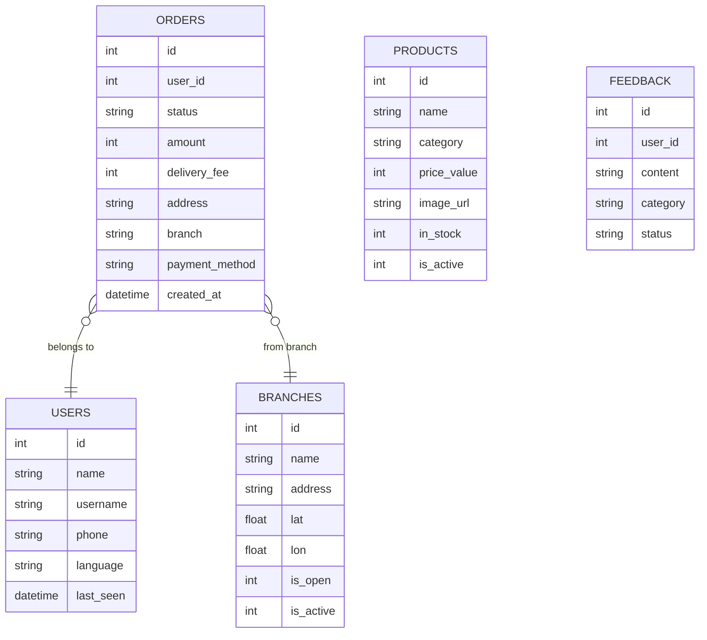
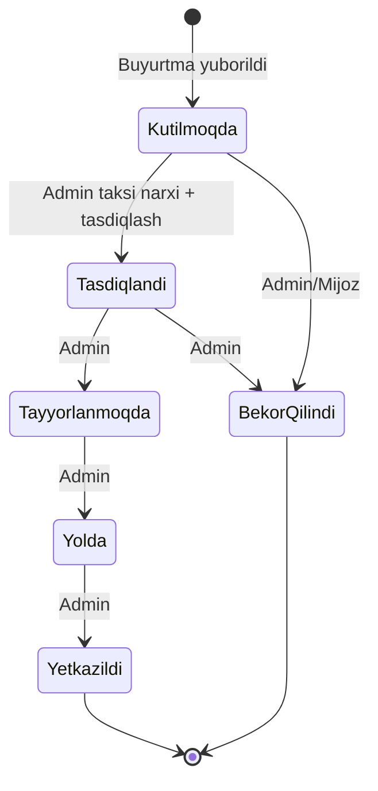
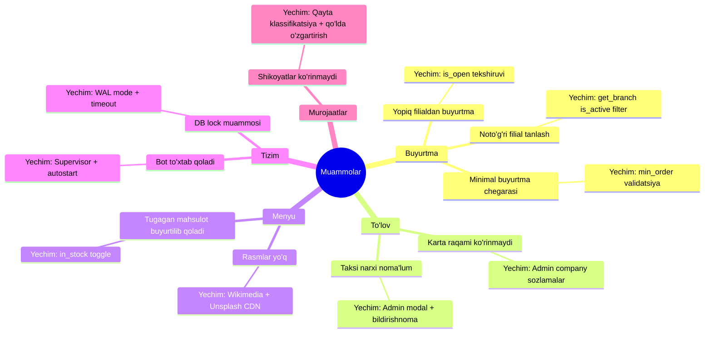

# 🍽️ Customer Service Bot — Loyiha Diagrammasi

> **Maqsad:** Restoran uchun Telegram orqali buyurtma qabul qilish, boshqarish va mijozlarga xizmat ko'rsatish tizimi.

---

## 🏗️ Tizim Arxitekturasi

---

## 📱 Mijoz (User) Oqimi

---

## 👑 Admin Oqimi

---

## 🗄️ Ma'lumotlar Bazasi Strukturasi

---

## 🔄 Buyurtma Statuslari

---

## 🧩 Funksiyalar Ro'yxati

### 👤 Mijoz uchun
| # | Funksiya | Tavsif |
|---|----------|--------|
| 1 | **Til tanlash** | UZ / EN / RU — to'liq tarjima |
| 2 | **GPS manzil** | Joylashuvni avtomatik aniqlash |
| 3 | **Yetkazib berish / Olib ketish** | Ikki xil usul |
| 4 | **Menyu + Rasmlar** | 32 ta Uzbek milliy taom, haqiqiy fotolar |
| 5 | **Savatcha** | Ko'p mahsulot, miqdor o'zgartirish |
| 6 | **Qo'shimchalar (Upsell)** | Yandex Eats uslubida, kategoriya chiplari |
| 7 | **Promokod** | Chegirma kodi qo'llash |
| 8 | **Karta / Naqd to'lov** | Karta raqamini ko'rish va nusxa olish |
| 9 | **Buyurtma holati** | Real-vaqt bildirishnomalar |
| 10 | **Buyurtma tarixi** | O'tgan buyurtmalarni ko'rish |
| 11 | **Buyurtmani bekor qilish** | 2 daqiqa ichida |
| 12 | **Murojaat yuborish** | Savol / Shikoyat / Taklif |
| 13 | **Qayta buyurtma** | Oldingi buyurtmani bir tugmada takrorlash |

### 👑 Admin uchun
| # | Funksiya | Tavsif |
|---|----------|--------|
| 1 | **Buyurtmalar boshqaruvi** | Real-vaqt, status o'zgartirish |
| 2 | **Taksi narxi kiritish** | Har buyurtma uchun alohida yetkazib berish narxi |
| 3 | **Mahsulotlar CRUD** | Qo'shish, tahrirlash, o'chirish |
| 4 | **Tugadi belgisi** | Mahsulotni bir tugmada yashirish |
| 5 | **Filiallar boshqaruvi** | Yoqish / O'chirish, ish vaqti |
| 6 | **Filial yopish** | Yopiq filialdan buyurtma qabul qilinmaydi |
| 7 | **Kunlik hisobot** | 23:00 da Telegram'ga avtomatik |
| 8 | **Statistika** | Daromad, top taomlar, grafik |
| 9 | **Murojaatlar** | Javob berish, kategoriyalash |
| 10 | **Promokodlar** | Yaratish, chegirma turi, muddat |
| 11 | **Kompaniya sozlamalari** | Karta raqami, Click, Payme, Alif |
| 12 | **Reklama yuborish** | Barcha mijozlarga xabar |

---

## 🚫 Hal Qilingan Muammolar

---

## 💰 Biznes Qiymati

| Muammo (Oldingi) | Yechim (Hozir) | Natija |
|------------------|----------------|--------|
| Telefon orqali buyurtma — vaqt yo'qotish | Telegram bot + WebApp 24/7 | **3x tez buyurtma** |
| Taksi narxini hisoblash — noto'g'riliklar | Admin modal — har buyurtmaga narx | **Aniq hisob-kitob** |
| Mijoz buyurtma holatini bilmaydi | Real-vaqt 5 bosqich bildirishnoma | **Kamroq qo'ng'iroq** |
| Tugagan mahsulot buyuriladi | In-stock toggle, grayout | **Nol noto'g'ri buyurtma** |
| Tun bo'yi monitoring | Kunlik hisobot 23:00 da | **Avtomatik nazorat** |
| Qo'shimcha taomlar sotilmaydi | Upsell kategoriya chiplari | **O'rtacha chek +20-30%** |

---

## 🔧 Texnik Stack

| Qism | Texnologiya |
|------|-------------|
| Bot | Python + python-telegram-bot |
| API | FastAPI + uvicorn |
| DB | SQLite (WAL mode) |
| Frontend | Vanilla JS + Telegram Mini App |
| Tunnel | Cloudflare Tunnel (HTTPS) |
| AI | Anthropic Claude (murojaatlar klassifikatsiyasi) |
| Hosting | Windows kompyuter (autostart) |
| CDN | Wikimedia Commons + Unsplash |

---

*Diagramma Obsidian + Mermaid plugin bilan to'liq ko'rinadi.*
